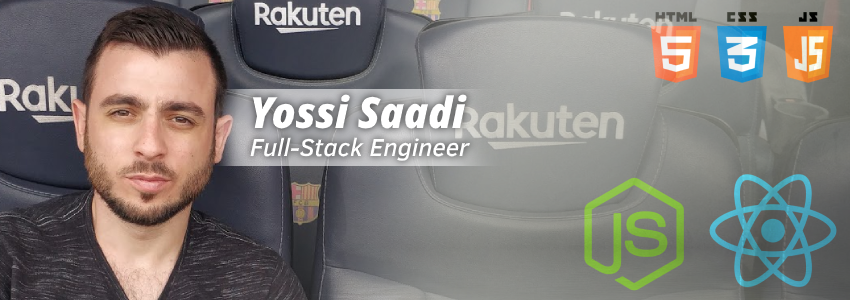

         

### Hey GitHub 👋

<b>I'm Yossi Saadi, 28, lives in the beautiful :raised_hands: land of Israel :israel: </b>
Recently graduated my <b>B.Sc degree</b> in <b>Software Engineering :student:</b> 

Works <b>@Duda</b> for the past 2 years as an <b>Automation Engineer</b>, using <b>Selenium</b> w/ <b>Java</b>. 
Remotely for the past half-year. :mask: 
On my day-to-day work I'm writing complex tests, and building <b>automation infrastructure</b>, both for tests and for integrating with external services - such as <b>Logz.io</b> (which was a GAME CHANGER for Duda's automation!), <b>AWS</b>, etc.. - to increase the power, accuracy and abilities of automation, and therefore making <b>Duda's products better and more stable</b> for our customers. 
During my time <b>@Duda</b> as an </b>Automation Engineer</b>, I also got to <b>develop few features for production users</b>, using <b>React</b> and <b>Java</b>, as I also have experience with <b>front-end frameworks</b>. 
I also got as-well to write <b>unit tests</b> using <b>React Testing Library</b>, <b>Mocha</b>, <b>Jest</b>, etc.. 

I use tools as <b>GitHub</b> (besides as VCS - <b>Actions</b>, <b>PR and CR</b> mechanism), <b>JIRA</b>, <b>Logz.io</b> and more to perform my work and been using a variety of other amazing tools on my spare-time and during my studies. 

<b>Aiming to have a career as a Full-Stack engineer (using React & Node).</b> 
Except <b>React</b> I also want to <b>deeply learn Vue 3</b>, as I believe the more frameworks and technologies you know, <b>the better developer you are</b>, as you learn from the best. 

My <b>B.Sc final project</b> was a <b>React Native app</b>, A smart social netwrok for selling and buying tickets for events between individuals.  
Therefore the <b>mobile</b> world is also something that I'm enthusiastic about, especially <b>cross-platform</b> ones as <b>RN</b> and <b>Flutter</b>. 

Except all the things I've used and mentioned above, I also use sometimes <b>Pythoon</b>, and been reading a lot about (and <b>implemented while learning Node</b>) <b>Blockchain</b> related stuff.  
I learned <b>deep fundamentals of Blockchain</b> independently, and have <b>deep familiar with cryptocurrencies and consensus algorithms</b>. 
On my spare time I love to read and take online courses related to my work and expand my knowledge :brain:. 
I'm also very into <b>Smart Home Automation</b>, using <b>Home Assistant</b> and variety of manufacturers (Xiaomi, Aqara, BlitzWolf, etc..), under the <b>Zigbee</b> protocol and <b>Wi-Fi</b>, also looking to start my main project making my stupid refrigerator a smart one :) 

As you can understand, my moto in life is -> <b>Work Hard, Play Hard!</b> 

Feel free to reach me through <b>GitHub, [LinkedIn Account](https://linkedin.com/in/YossiSaadi), or via my [Email Address](mailto:yossisaadi@gmail.com)</b> :)
