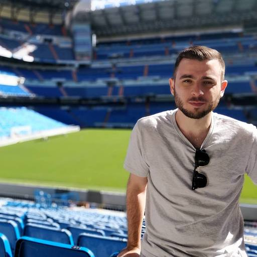

PICTURE -> YOSSI SAADI FULL STACK ENGINEER 

         

### Hey GitHub 👋

I'm Yossi Saadi, 28, lives in the beautiful :raised_hands: land of Israel :israel: 
Recently graduated my B.Sc degree in Software Engineering :student: 

Works @Duda for the past 2 years as an Automation Engineer, using Selenium w/ Java. 
Remotely for the past half-year. :mask: 
On my day-to-day work I'm writing complex tests, and building automation infrastructure, both for tests and for integrating with external services - such as Logz.io (which was a GAME CHANGER for Duda's automation!), AWS, etc.. - to increase the power, accuracy and abilities of automation, and therefore making Duda's products better and more stable for our customers. 
During my time @Duda as an Automation Engineer, I also got to develop few features for production users, using React and Java, as I also have experience with front-end frameworks. 
I also got as-well to write unit tests using React Testing Library, Mocha, Jest, etc.. 

I use tools as GitHub (Actions, PR and CR mechanism), JIRA, Logz.io and more to perform my work and been using a variety of other amazing tools on my spare-time and during my studies. 

Aiming to have a career as a Full-Stack engineer (using React & Node). 
Except React I also want to deeply learn Vue 3, as I believe the more frameworks and technologies you know, the better developer you are, as you learn from the best. 

My B.Sc final project was a React Native app, A smart social netwrok for selling and buying tickets for events between individuals.  
The mobile world is also something that I'm enthusiastic about, especially cross-platform ones as RN and Flutter. 

Except all the things I've used and mentioned above, I also use sometimes Pythoon, and been reading a lot about (and implemented while learning Node) Blockchain related stuff.  
I learned deep fundamentals of Blockchain independently, and have deep familiar with cryptocurrencies and consensus algorithms. 
On my spare time I love to read and take online courses related to my work and expand my knowledge :brain:. 

As you can understand, my moto in life is -> Work Hard, Play Hard! 

You can reach me through GitHub, [LinkedIn Account](https://linkedin.com/in/YossiSaadi), or via my [Email Address](mailto:yossisaadi@gmail.com)
